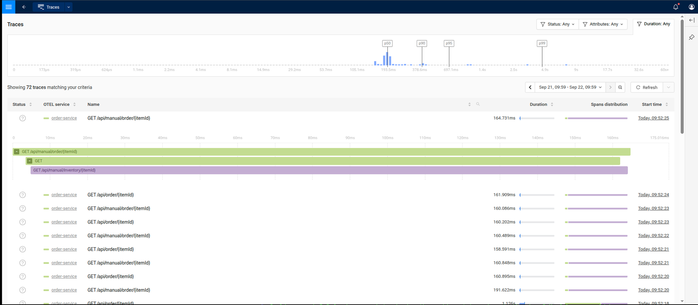
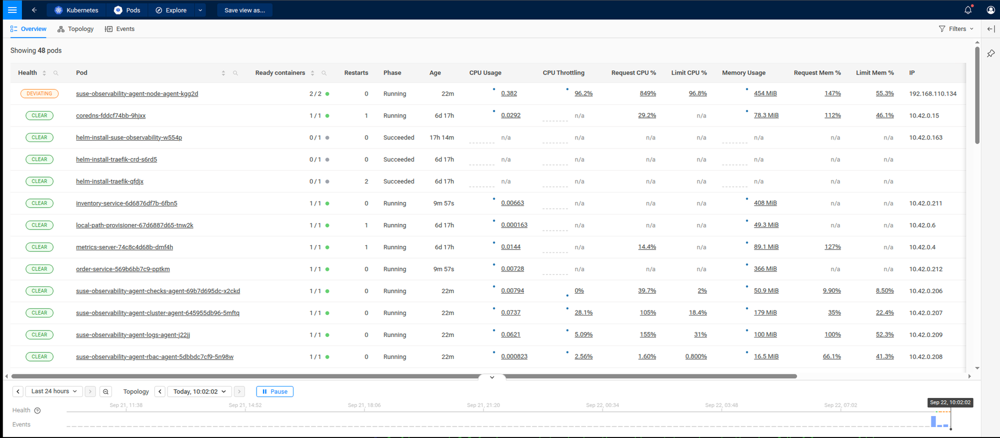
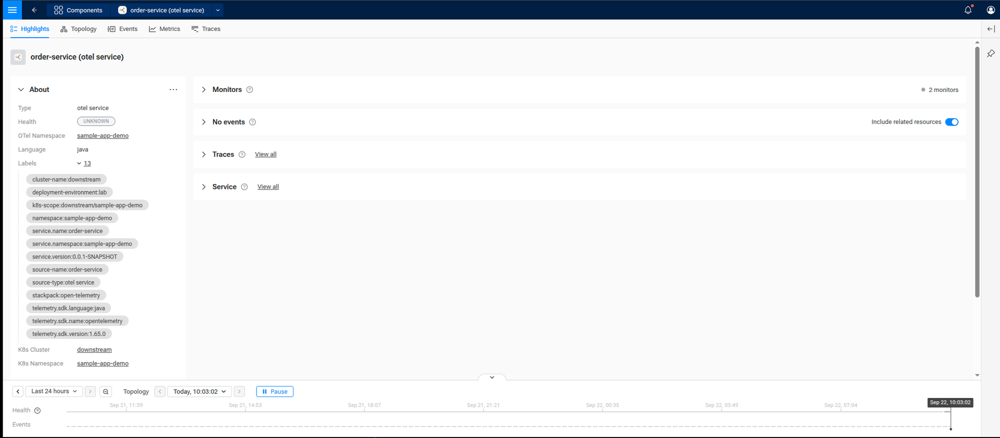

# SUSE Observability – Sample Java App

[](LICENSE)

🇧🇷 [Leia em português](README.pt-BR.md)

Minimal Spring Boot application used to demonstrate how a "normal" Java
app (outside a Kubernetes cluster) sends **logs** and **traces** via OTLP
to SUSE Observability, using the OpenTelemetry Java agent (zero-code /
auto-instrumentation) and, optionally, manually-added span attributes via
the API.

## Summary

- [Overview](#overview)
- [Application endpoints](#application-endpoints)
- [Build](#build)
- [Running locally with Docker](#running-locally-with-docker)
- [Connecting to a SUSE Observability instance outside the cluster](#connecting-to-a-suse-observability-instance-outside-the-cluster)
- [Authentication (API key)](#authentication-api-key)
- [Demo: auto-instrumentation vs. manual instrumentation](#demo-auto-instrumentation-vs-manual-instrumentation)
- [Checking traces in the UI](#checking-traces-in-the-ui)
- [Known limitations](#known-limitations)
- [Deploying to Kubernetes](#deploying-to-kubernetes)
- [Correlating with Kubernetes topology](#correlating-with-kubernetes-topology)
- [Security](#security)

## Overview

The OpenTelemetry Java agent (`opentelemetry-javaagent.jar`) is downloaded
during the Docker image build and injected via `-javaagent`. With it,
frameworks like Spring MVC and `RestTemplate` are automatically
instrumented — spans are created for every incoming HTTP request and every
outgoing HTTP call made by the application, without changing a single line
of code.

To generate real traces (not just logs), the application needs some
activity the agent knows how to instrument: HTTP, JDBC, messaging, etc. A
loop that only calls `logger.info()` produces no spans at all. That's why
the app exposes REST endpoints that make an internal HTTP call
(`/api/order` → `/api/inventory`), generating a trace with nested spans
(server → client → server).

## Application endpoints

| Endpoint | Instrumentation | Description |
|---|---|---|
| `GET /api/order/{itemId}` | Auto-instrumentation only (zero code) | Calls `/api/inventory/{itemId}` via `RestTemplate` |
| `GET /api/inventory/{itemId}` | Auto-instrumentation only (zero code) | Simulates a stock lookup (~150ms) |
| `GET /api/manual/order/{itemId}` | Auto-instrumentation + manual attributes | Same flow as `/api/order`, but enriches the span with business attributes |
| `GET /api/manual/inventory/{itemId}` | Auto-instrumentation + manual attributes | Same flow as `/api/inventory`, likewise |

Any item whose `hashCode() % 5 == 0` is treated as "out of stock" (produces
a `logger.warn`/`logger.error` and, on the `/api/manual/*` endpoints, the
`order.status=rejected` attribute) — useful for forcing variation in the
traces during the demo.

In addition, the `ObservabilityTestApplication` class keeps the original
log loop (`Mensagem de rotina #N`, with a `warn` every 5th message and an
`error` every 10th), which keeps running alongside the web server — useful
for testing the **logs** exporter independently of traces.

## Build

Requires Java 17. Without a local Maven install, use a container:

```bash
docker run --rm -v "$PWD":/app -w /app maven:3.9-eclipse-temurin-17 \
  mvn -q clean package -DskipTests
```

Or, if you have Maven/Maven Wrapper installed:

```bash
make build
```

## Running locally with Docker

```bash
make docker   # builds the image with the OTel agent embedded (SLE BCI + OpenJDK 17)
make run      # runs the container with --network host, pointed at the OTLP endpoint
```

The OTel export variables used by `make run` (see `Makefile`):

```
OTEL_SERVICE_NAME=java-app-bci-local
OTEL_LOGS_EXPORTER=otlp
OTEL_TRACES_EXPORTER=otlp
OTEL_METRICS_EXPORTER=none
OTEL_EXPORTER_OTLP_ENDPOINT=http://localhost:4317
OTEL_EXPORTER_OTLP_PROTOCOL=grpc
OTEL_EXPORTER_OTLP_HEADERS=Authorization=SUSEObservability%20<api-key>
```

Test it:

```bash
curl http://localhost:8080/api/order/42
curl http://localhost:8080/api/manual/order/42
```

Follow the agent's logs (loaded version, any export errors):

```bash
docker logs -f java-otel-bci
```

To stop: `make stop`.

## Connecting to a SUSE Observability instance outside the cluster

Tested scenario: a SUSE Observability instance running inside a k3s
cluster, inside a local KVM VM, on an isolated NAT network (`virbr-suse`,
`192.168.110.0/24`) — not directly reachable from the local network
(192.168.86.x), nor, in many setups, even from the VM's own host, because
the chart's `otel-collector` is only exposed as a `ClusterIP` (no
`hostPort`/`NodePort` enabled by default).

To test from the VM's host (or wherever you're running the app from), open
an SSH tunnel directly to the collector pod's IP, rather than trying to
reach the node's IP:

```bash
# find the pod and its IP inside the VM
ssh root@<vm-ip> "kubectl -n suse-observability get pod -l app.kubernetes.io/name=suse-observability-otel-collector -o wide"

# open the local tunnel (keep it running in the background)
ssh -f -N -L 4317:<pod-ip>:4317 -L 4318:<pod-ip>:4318 root@<vm-ip>
```

With the tunnel up, `localhost:4317`/`localhost:4318` on your host become
SUSE Observability's OTLP gRPC/HTTP endpoint. That's the endpoint
`OBSERVABILITY_ENDPOINT` in the `Makefile` uses.

> Note on bridged/macvtap networks: if the VM is attached to the LAN via
> macvtap (`type='direct'`, `mode='bridge'`) to get a DHCP IP on the
> 192.168.86.x network, the **host** that created the macvtap interface can
> never talk to the VM itself through that same physical NIC — this is a
> Linux kernel limitation (no hairpin), not a misconfiguration. Other
> devices on the LAN can reach the VM normally. In this project we chose
> to keep the VM on the internal NAT network only and use an SSH tunnel
> for testing from the host.

## Authentication (API key)

SUSE Observability uses its own authorization scheme on the OTLP receiver
(the `ingestion_api_key_auth` extension, `schema: SUSEObservability` in
the chart's `values.yaml`). The expected header is:

```
Authorization: SUSEObservability <api-key>
```

In the `OTEL_EXPORTER_OTLP_HEADERS` environment variable (which follows a
`key=value` format separated by commas, with no automatic URL-decoding of
the value), the space between the scheme and the key needs to be
URL-encoded:

```
OTEL_EXPORTER_OTLP_HEADERS=Authorization=SUSEObservability%20<api-key>
```

Quick `curl` test (via the tunnel, port 4318/HTTP) to validate a key
without having to bring up the whole application:

```bash
curl -i -X POST http://localhost:4318/v1/traces \
  -H "Content-Type: application/json" \
  -H "Authorization: SUSEObservability <api-key>" \
  --data '{"resourceSpans":[{"resource":{"attributes":[{"key":"service.name","value":{"stringValue":"api-key-test"}}]},"scopeSpans":[{"scope":{"name":"manual-test"},"spans":[{"traceId":"5B8EFFF798038103D269B633813FC60C","spanId":"EEE19B7EC3C1B174","name":"test-span","kind":1,"startTimeUnixNano":"1700000000000000000","endTimeUnixNano":"1700000000100000000"}]}]}]}'
```

- No header or invalid key → `401 Unauthorized`
- Valid key → `200` with `{"partialSuccess":{}}`

## Demo: auto-instrumentation vs. manual instrumentation

The app has two behaviorally identical pairs of endpoints, for side-by-side
comparison in SUSE Observability:

1. **Pure auto-instrumentation** — `OrderController` /
   `InventoryController` (`/api/order`, `/api/inventory`). No
   OpenTelemetry-related code at all. Every span (HTTP server + HTTP
   client) comes for free from the javaagent.

2. **Targeted instrumentation** — `ManualOrderController` /
   `ManualInventoryController` (`/api/manual/order`,
   `/api/manual/inventory`). Same flow, but using
   `Span.current().setAttribute(...)` (dependency
   `io.opentelemetry:opentelemetry-api`, compile-time only — the javaagent
   injects the real implementation at runtime) to add business attributes
   to the span already created by auto-instrumentation: `order.item_id`,
   `order.available`, `order.status`, `inventory.item_id`,
   `inventory.available`.

To demonstrate:

```bash
curl http://localhost:8080/api/order/42          # trace with only default HTTP attributes
curl http://localhost:8080/api/order/5           # forces "out of stock" (5 % 5 == 0)

curl http://localhost:8080/api/manual/order/42   # same trace + business attributes
curl http://localhost:8080/api/manual/order/5
```

In SUSE Observability, compare the spans from `/api/order/*` with those
from `/api/manual/order/*`: the structure (server → client → server) is
identical, but only the second group carries the custom attributes.

## Checking traces in the UI

After hitting the endpoints (`curl http://localhost:8080/api/order/42`
etc.), traces show up in the SUSE Observability UI within a few seconds:



1. Open the UI (the same host configured in `OTEL_EXPORTER_OTLP_ENDPOINT`,
   usually via ingress/port 443, not the OTLP port 4317/4318).
2. In the side menu (hamburger icon in the top-left corner), scroll until
   you find **Traces** — it's a top-level item, outside the "Open
   Telemetry" section.
3. The list shows all recent traces, with **Status**, **OTEL service**,
   **Name** (HTTP route), **Duration**, and **Start time**. Use the
   filters (`Status`, `Attributes`, `Duration`, time range) to narrow the
   search — for example, filter by `order-service` or `inventory-service`
   to find the traces generated by the tests above.
4. Click a row in the table to expand the trace's waterfall inline: you'll
   see the `GET /api/order/{itemId}` span (server, on `order-service`)
   containing a child `GET` span (client) which in turn contains
   `GET /api/inventory/{itemId}` (server, on `inventory-service`) — exactly
   the server → client → server chain described in the previous section.
5. Click a specific span in the waterfall to open the **Span details**
   panel on the right, with `Status`, `Span kind`, `Scope name/version`,
   `Start/End time`, etc.
6. Expand **Span attributes** in that panel to see the span's attributes.
   On the `/api/manual/*` endpoints, this is where the custom attributes
   added via `Span.current().setAttribute(...)` show up: `order.item_id`,
   `order.available`, `order.status` (and the `inventory.*` equivalents on
   the inventory-service side) — alongside the default HTTP/network
   attributes (`http.route`, `http.response.status_code`,
   `network.peer.address`, etc.) that come for free from
   auto-instrumentation.

## Known limitations

- **"Component not found" when clicking a service from a trace, or empty
  `Kubernetes > Pods`/`Open Telemetry > Services` views, is almost never
  an application-instrumentation problem.** We investigated this symptom
  in depth (see `TOPOLOGY-TROUBLESHOOTING.md` in this repo for the full
  history), and the root cause **wasn't** in the app or in the OTel
  collector — trace/log ingestion always worked. The three missing
  requirements, all on the platform side:
  1. The `suse-observability` chart alone only stands up the backend. You
     also need to install the **`suse-observability-agent`** chart
     (cluster-agent, etc.) — it's the one that watches the Kubernetes API
     and materializes Pods/Deployments as Components.
  2. That agent's `stackstate.cluster.name` needs to exactly match the
     name configured on the **Kubernetes** StackPack instance
     (**Settings → StackPacks → Installed Instances** in the UI) —
     mismatched names mean the instance stays "Installed. Waiting for
     data..." forever, with no visible error.
  3. The instrumented application needs to emit `k8s.*` resource
     attributes (pod name, namespace, node) so the OpenTelemetry StackPack
     can correlate the `service`/`service-instance` with the real Pod —
     without this, traces keep showing up normally in the Traces view,
     but the service's Component is never created. See [Correlating with
     Kubernetes topology](#correlating-with-kubernetes-topology) for how
     this project handles it.

  If you only need to validate that instrumentation is working, the
  **Traces** view is enough on its own, independent of those three
  points — OTLP ingestion never depended on them.
- **Platform REST/GraphQL API not tested with the ingestion API key.**
  This project only validates the OTLP ingestion path
  (`OTEL_EXPORTER_OTLP_HEADERS`); programmatic queries via the SUSE
  Observability API (outside the UI) are out of scope here.
- **No metrics.** The project intentionally disables the metrics exporter
  (`OTEL_METRICS_EXPORTER=none`) to keep the focus on traces and logs —
  there are no metrics dashboards to validate in this demo.

## Deploying to Kubernetes

Besides the `deployment.yaml` at the repo root (a generic manifest example
for a single service outside this cluster, documented inline in the
file), the `k8s/` directory contains a **real, in-cluster** deployment —
`order-service` and `inventory-service` as two real Deployments/Services
in the k3s cluster, calling each other via the cluster's internal DNS.
This is the recommended way to test the full topology (not just traces),
because:

- No SSH tunnel or externally-exposed `ClusterIP` is needed — the app
  talks to
  `suse-observability-otel-collector.suse-observability.svc.cluster.local:4317`
  directly.
- It generates a real `order-service → inventory-service` relation between
  two real Pods, correlatable with the Kubernetes topology (see the next
  section).

Step by step (tested on a single-node k3s):

```bash
# 1. build the image locally (same Dockerfile as the rest of the project)
docker build -t sample-java-app:k8s-demo .

# 2. import the image into the cluster's containerd (no registry needed —
#    handy in labs without a registry of their own; swap for `docker push`
#    in a real setup with a registry configured)
docker save sample-java-app:k8s-demo -o /tmp/sample-java-app.tar
scp /tmp/sample-java-app.tar root@<vm-ip>:/root/
ssh root@<vm-ip> "k3s ctr images import /root/sample-java-app.tar"

# 3. create the namespace and the Secret holding the OTLP header (never commit the key/token)
kubectl create namespace sample-app-demo
kubectl create secret generic sample-app-observability -n sample-app-demo \
  --from-literal=otlp-headers='Authorization=SUSEObservability%20<api-key-or-service-token>'

# 4. apply the manifests
kubectl apply -f k8s/inventory-deployment.yaml -f k8s/order-deployment.yaml

# 5. generate traffic
kubectl exec -n sample-app-demo deploy/order-service -- curl -s http://localhost:8080/api/order/42
kubectl exec -n sample-app-demo deploy/order-service -- curl -s http://localhost:8080/api/manual/order/42
```

The manifests use `imagePullPolicy: Never` (because the image only exists
locally in the node's containerd, imported in step 2) and
`runAsNonRoot: true` + `runAsUser: 1000` — the image's `appuser` (see
`Dockerfile`) is UID 1000 but non-numeric in `USER`, and Kubernetes can't
validate `runAsNonRoot` without the explicit UID (you get a
`CreateContainerConfigError` otherwise).

## Correlating with Kubernetes topology

Running inside the cluster (previous section) solves the networking part,
but **isn't enough on its own** for the service to show up as a Component
correlated to a real Pod — the application also needs to emit `k8s.*`
attributes in the OTel resource, via the Kubernetes Downward API. The
manifests in `k8s/` already do this:

```yaml
env:
  - name: K8S_POD_NAME
    valueFrom: { fieldRef: { fieldPath: metadata.name } }
  - name: K8S_POD_UID
    valueFrom: { fieldRef: { fieldPath: metadata.uid } }
  - name: K8S_NAMESPACE_NAME
    valueFrom: { fieldRef: { fieldPath: metadata.namespace } }
  - name: K8S_NODE_NAME
    valueFrom: { fieldRef: { fieldPath: spec.nodeName } }
  - name: OTEL_RESOURCE_ATTRIBUTES
    value: "deployment.environment=lab,service.namespace=sample-app-demo,\
k8s.pod.name=$(K8S_POD_NAME),k8s.pod.uid=$(K8S_POD_UID),\
k8s.namespace.name=$(K8S_NAMESPACE_NAME),k8s.node.name=$(K8S_NODE_NAME),\
k8s.deployment.name=order-service,k8s.cluster.name=<your-kubernetes-stackpack-instance-name>"
```

`$(VAR)` inside an `env` value references another variable declared in the
same container (native Kubernetes interpolation) — no init container or
wrapper script needed.

`k8s.cluster.name` needs to match **exactly** the name configured on the
Kubernetes StackPack instance installed on the platform (**Settings →
StackPacks → Kubernetes → Installed Instances**), not your actual
cluster/VM name. Without that match, the Kubernetes StackPack's components
(Pods/Deployments) never show up — the instance stays "Installed. Waiting
for data..." indefinitely, with no visible error — and, as a consequence,
the OpenTelemetry StackPack also can't correlate your app's
`service`/`service-instance` with a real Pod.

With the correct attributes, after generating traffic:

1. **Kubernetes > Pods** (filters Clusters: All / Namespaces: All) starts
   listing the cluster's real Pods, including `order-service-*` and
   `inventory-service-*`.

   

2. In the **Traces** list, clicking a service name (`order-service`) no
   longer gives "Component not found" — it opens the real Component, with
   Topology/Events/Metrics, and the labels show the full correlation
   (`k8s-scope`, `K8s Cluster`, `K8s Namespace`, etc.):

   

Signal on the platform side that correlation is working: the
`suse-observability-otel-collector-0` pod's logs (namespace
`suse-observability`) show, shortly after the first traffic with the
`k8s.*` attributes present, a `Topology stream created` line for
`dataSource: "urn:stackpack:open-telemetry:otel-component-mapping:service"`
(and `...:service-instance`, `...:pod`) — without the `k8s.*` attributes,
these specific streams never get created, even with traces ingesting
normally.

## Security

This repository's `Makefile` uses a placeholder
(`OBSERVABILITY_API_KEY = <your-suse-observability-api-key>`) — replace it
with your own key before running `make run`. Before versioning/sharing
this project beyond your local use:

- Replace `OBSERVABILITY_API_KEY` with an environment variable or a
  version-control-excluded `.env` file.
- Never hardcode the key in `deployment.yaml` — use a Kubernetes `Secret`.
